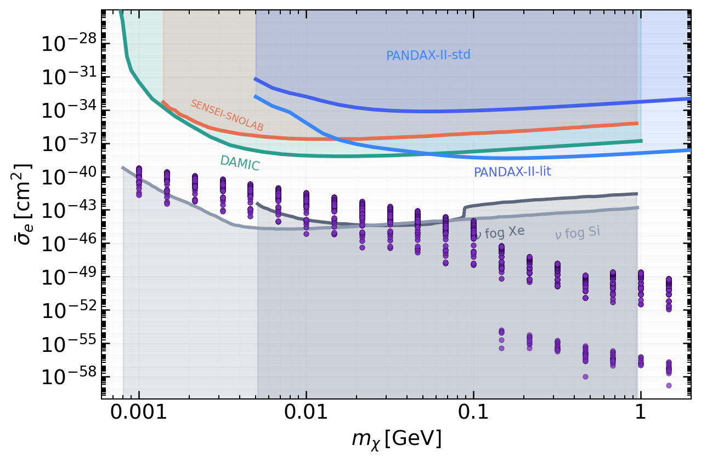

# Numerical Simulation and Data Analysis Pipeline

Python project for numerical simulation, parameter sweeps, data analysis, and scientific visualization.

This repository contains a computational pipeline for studying a hidden vector dark matter model. The project uses a theoretical physics case study, but the workflow shows skills in Python programming, numerical methods, simulation analysis, data processing, and visualization.

## Project Overview

The pipeline solves a Boltzmann differential equation to model the evolution of a dark matter abundance. It then runs parameter sweeps over model parameters, analyzes the numerical outputs, identifies viable regions, and compares results with direct detection constraints.

The main workflow includes:

* Running a single numerical simulation
* Solving stiff differential equations
* Performing parameter scans
* Filtering and analyzing simulation outputs
* Interpolating external datasets
* Creating visualizations from numerical and experimental data

## Skills Demonstrated

* Python programming for scientific computing
* Numerical solution of differential equations
* Parameter sweeps and simulation analysis
* Data cleaning, filtering, and interpolation
* Parallel computation with multiprocessing
* Scientific visualization with Matplotlib
* Modular code organization
* Quantitative modeling and data driven analysis

## Package Used

* Python
* NumPy
* SciPy
* Matplotlib
* Pandas
* Jupyter Notebook
* multiprocessing

## Repository Structure

```text
evolver/           Core package with the model, equations, integrator, interpolation, and utilities
DirectDetection/   Direct detection notebooks, CSV datasets, and generated visualizations
data/              Output folder for generated simulation files
run.py             Runs one numerical simulation
plot.py            Generates diagnostic plots from one simulation
AnalyzeSweep.py    Processes parameter sweep outputs and extracts viable points
requirements.txt   Python dependencies
```

## Installation

Clone the repository and install the dependencies:

```bash
pip install -r requirements.txt
```

## Usage

Run a single simulation choosig the four free parameters of the model:

```bash
python run.py
```

Generate diagnostic plots from a single simulation:

```bash
python plot.py data/output output.pdf
```
Run a parameter sweep by choosing the parameter ranges in evolver/runSweep.py:

```bash
python -m evolver.runSweep
```

Analyze the parameter sweep:

```bash
python AnalyzeSweep.py
```

## Example Output

The project includes direct detection visualizations comparing model predictions with external constraint datasets.



## Notes

Simulation outputs are generated locally inside the `data/` folder and are not tracked by Git. This keeps the repository focused on source code, analysis notebooks, input datasets, and representative visualizations.

## About

Although the case study comes from theoretical physics, this project is designed to showcase practical and transferable skills in numerical simulation, data analysis, scientific computing, and visualization.
